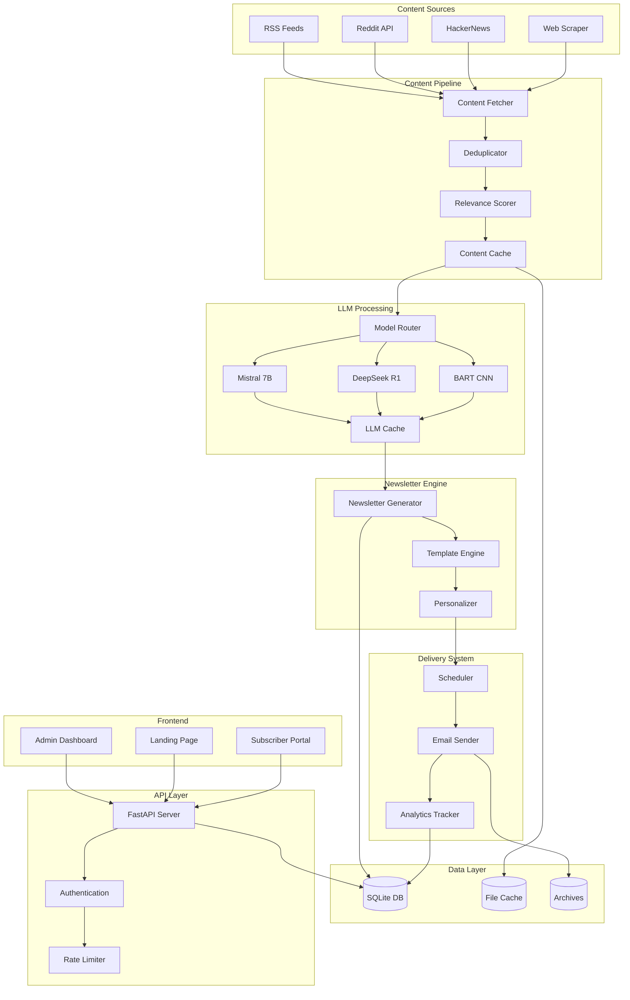

# 🏗️ Newsauto Architecture

## Overview

Newsauto is a modular, event-driven newsletter automation platform that leverages local LLMs for content processing. The architecture prioritizes scalability, maintainability, and zero-cost operation.

## System Architecture



## Component Architecture

### 1. Content Aggregation Layer

```python
scrapers/
├── base_scraper.py      # Abstract base class
├── rss_fetcher.py       # RSS feed parser
├── reddit_api.py        # Reddit PRAW client
├── hackernews.py        # HN API integration
├── web_scraper.py       # BeautifulSoup scraper
└── aggregator.py        # Orchestrates all scrapers
```

**Key Features:**
- Async/concurrent fetching
- Rate limiting per source
- Automatic retry with exponential backoff
- Content validation and sanitization

### 2. Content Processing Pipeline

```python
pipeline/
├── deduplicator.py      # Hash-based deduplication
├── scorer.py            # Relevance scoring algorithm
├── classifier.py        # Content categorization
├── cache_manager.py     # LRU cache implementation
└── processor.py         # Main pipeline orchestrator
```

**Processing Flow:**
1. Fetch raw content
2. Extract article text
3. Generate content hash
4. Check duplicate cache
5. Score relevance (0-100)
6. Classify content type
7. Store in cache

### 3. LLM Integration Layer

```python
llm/
├── base_model.py        # Abstract LLM interface
├── ollama_client.py     # Ollama integration
├── model_router.py      # Intelligent routing
├── prompt_templates.py  # Template management
├── cache.py            # Response caching
└── fallback.py         # Fallback strategies
```

**Model Selection Logic:**
```python
def select_model(content_type, length, priority):
    if content_type == "news" and length < 1000:
        return "bart-large-cnn"
    elif content_type == "technical":
        return "deepseek-r1:7b"
    elif priority == "speed":
        return "phi-3-mini"
    else:
        return "mistral:7b-instruct"
```

### 4. Newsletter Generation Engine

```python
newsletter/
├── generator.py         # Main generation logic
├── templates/
│   ├── base.html       # Base template
│   ├── tech.html       # Tech newsletter
│   └── digest.html     # General digest
├── personalizer.py     # User personalization
├── formatter.py        # HTML/text formatting
└── validator.py        # Output validation
```

**Generation Pipeline:**
1. Select content items
2. Apply user preferences
3. Generate summaries
4. Render template
5. Personalize content
6. Validate output

### 5. Database Schema

```sql
-- Core Tables
newsletters (
    id INTEGER PRIMARY KEY,
    name TEXT NOT NULL,
    niche TEXT,
    template_id INTEGER,
    settings JSON,
    created_at TIMESTAMP
)

subscribers (
    id INTEGER PRIMARY KEY,
    email TEXT UNIQUE NOT NULL,
    name TEXT,
    preferences JSON,
    segments JSON,
    status TEXT,
    subscribed_at TIMESTAMP
)

content_items (
    id INTEGER PRIMARY KEY,
    source_id INTEGER,
    url TEXT UNIQUE,
    title TEXT,
    content TEXT,
    summary TEXT,
    score REAL,
    published_at TIMESTAMP,
    processed_at TIMESTAMP
)

editions (
    id INTEGER PRIMARY KEY,
    newsletter_id INTEGER,
    content JSON,
    sent_at TIMESTAMP,
    stats JSON
)

-- Indexes for performance
CREATE INDEX idx_content_score ON content_items(score DESC);
CREATE INDEX idx_subscriber_status ON subscribers(status);
CREATE INDEX idx_editions_sent ON editions(sent_at DESC);
```

### 6. API Design

```python
# RESTful API Structure
/api/v1/
├── /newsletters
│   ├── GET    /           # List newsletters
│   ├── POST   /           # Create newsletter
│   ├── GET    /{id}       # Get newsletter
│   ├── PUT    /{id}       # Update newsletter
│   └── DELETE /{id}       # Delete newsletter
│
├── /subscribers
│   ├── GET    /           # List subscribers
│   ├── POST   /           # Add subscriber
│   ├── GET    /{id}       # Get subscriber
│   └── PUT    /{id}       # Update subscriber
│
├── /content
│   ├── GET    /           # List content
│   ├── POST   /fetch      # Trigger fetch
│   └── GET    /{id}       # Get content item
│
├── /editions
│   ├── GET    /           # List editions
│   ├── POST   /generate   # Generate edition
│   └── POST   /send       # Send edition
│
└── /analytics
    ├── GET    /overview   # Dashboard metrics
    ├── GET    /opens      # Open tracking
    └── GET    /clicks     # Click tracking
```

## Data Flow

### Content Ingestion Flow

```
1. Scheduler triggers content fetch (cron/manual)
2. Aggregator spawns concurrent scrapers
3. Each scraper fetches from its source
4. Content flows through processing pipeline
5. Processed content stored in database
6. Cache updated with new content
```

### Newsletter Generation Flow

```
1. Scheduler triggers newsletter generation
2. Generator queries recent content by score
3. Content routed to appropriate LLM
4. Summaries generated and cached
5. Template rendered with content
6. Personalization applied per subscriber
7. Final newsletter stored in editions table
```

### Delivery Flow

```
1. Delivery scheduler checks pending editions
2. Subscriber list segmented by preferences
3. Emails rendered with tracking pixels
4. Batch sent via SMTP/API
5. Delivery status tracked
6. Analytics updated in real-time
```

## Scalability Considerations

### Horizontal Scaling

```yaml
# Multi-instance deployment
instances:
  - scraper: 3 workers
  - llm_processor: 2 workers
  - email_sender: 5 workers

# Load balancing
load_balancer:
  algorithm: round_robin
  health_check: /health
```

### Performance Optimizations

1. **Caching Strategy**
   - LLM responses: 7-day TTL
   - Content items: 24-hour TTL
   - User preferences: In-memory

2. **Batch Processing**
   - Content fetching: 10 concurrent
   - LLM inference: 4 parallel
   - Email sending: 100 per batch

3. **Database Optimization**
   - Connection pooling
   - Prepared statements
   - Regular VACUUM operations

## Security Architecture

### Authentication & Authorization

```python
# JWT-based authentication
security/
├── auth.py           # JWT generation/validation
├── permissions.py    # Role-based access
├── rate_limiter.py   # API rate limiting
└── encryption.py     # Data encryption
```

### Data Protection

- **Subscriber PII**: Encrypted at rest
- **API Keys**: Environment variables only
- **Passwords**: Bcrypt with salt
- **Sessions**: Secure, httpOnly cookies

## Deployment Architecture

### Local Development

```bash
# Single machine setup
- Ollama server: localhost:11434
- FastAPI: localhost:8000
- SQLite: ./data/newsletter.db
```

### Production (GitHub Actions)

```yaml
# Automated deployment
on:
  schedule:
    - cron: '0 8 * * *'

jobs:
  newsletter:
    runs-on: ubuntu-latest
    steps:
      - fetch_content
      - generate_summaries
      - create_newsletter
      - send_emails
      - update_analytics
```

### Cloud-Ready Architecture

```yaml
# Docker Compose setup
services:
  api:
    image: newsauto-api
    ports: ["8000:8000"]

  ollama:
    image: ollama/ollama
    volumes: ["./models:/models"]

  postgres:
    image: postgres:15
    volumes: ["./data:/var/lib/postgresql/data"]

  redis:
    image: redis:7

  nginx:
    image: nginx
    ports: ["80:80", "443:443"]
```

## Monitoring & Observability

### Metrics Collection

```python
metrics/
├── performance.py    # Response times, throughput
├── business.py      # Subscribers, engagement
├── system.py        # CPU, memory, GPU usage
└── errors.py        # Error rates, failures
```

### Logging Strategy

```python
# Structured logging
import structlog

logger = structlog.get_logger()

logger.info("newsletter_sent",
    newsletter_id=123,
    subscriber_count=456,
    duration_ms=789
)
```

## Technology Stack

### Core Technologies
- **Language**: Python 3.12+
- **Framework**: FastAPI
- **Database**: SQLite (dev) / PostgreSQL (prod)
- **Cache**: File-based (dev) / Redis (prod)
- **Queue**: Python asyncio (dev) / Celery (prod)

### LLM Stack
- **Server**: Ollama
- **Models**: Mistral 7B, DeepSeek R1, Phi-3
- **Fallback**: HuggingFace Transformers

### Infrastructure
- **Container**: Docker
- **Orchestration**: Docker Compose / Kubernetes
- **CI/CD**: GitHub Actions
- **Monitoring**: Prometheus + Grafana

## Design Patterns

### 1. Strategy Pattern (LLM Selection)
```python
class LLMStrategy(ABC):
    @abstractmethod
    def summarize(self, text: str) -> str:
        pass

class MistralStrategy(LLMStrategy):
    def summarize(self, text: str) -> str:
        # Mistral-specific implementation
        pass
```

### 2. Observer Pattern (Event System)
```python
class EventBus:
    def __init__(self):
        self.subscribers = defaultdict(list)

    def subscribe(self, event_type, handler):
        self.subscribers[event_type].append(handler)

    def publish(self, event_type, data):
        for handler in self.subscribers[event_type]:
            handler(data)
```

### 3. Factory Pattern (Scraper Creation)
```python
class ScraperFactory:
    @staticmethod
    def create_scraper(source_type: str) -> BaseScraper:
        if source_type == "rss":
            return RSSFetcher()
        elif source_type == "reddit":
            return RedditAPI()
        # ...
```

## Performance Targets

- **Content Fetching**: < 5 seconds for 100 articles
- **LLM Summarization**: < 1 second per article
- **Newsletter Generation**: < 30 seconds total
- **Email Delivery**: 1000 emails/minute
- **API Response**: < 200ms p95
- **Dashboard Load**: < 1 second

## Future Architecture Considerations

### Phase 2 Enhancements
- WebSocket support for real-time updates
- GraphQL API alongside REST
- Microservices architecture
- Event sourcing for audit trail

### Phase 3 Scaling
- Multi-tenant support
- Kubernetes deployment
- Global CDN for assets
- Multi-region database replication

---

This architecture is designed to be simple enough to run on a single machine while being sophisticated enough to scale to thousands of subscribers without architectural changes.