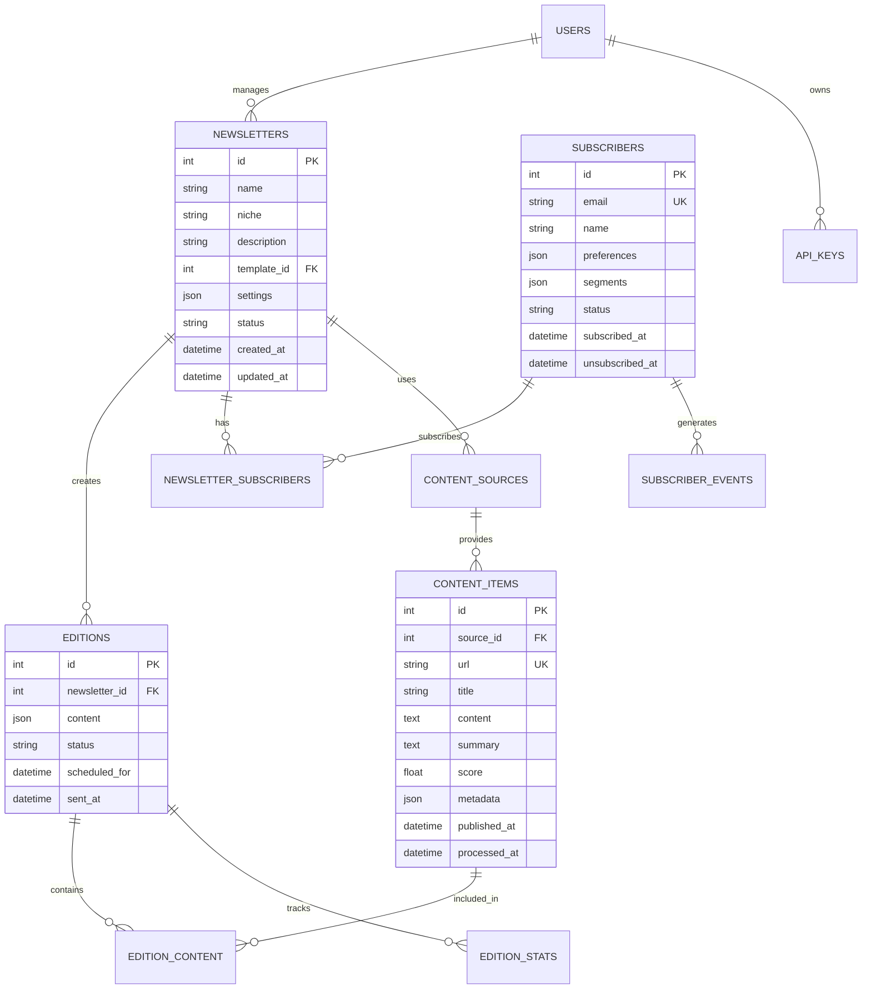

# 🗄️ Database Schema Documentation

## Overview

Newsauto uses SQLite for development and can scale to PostgreSQL for production. The schema is designed for flexibility, performance, and easy migration between database systems.

## Database Design Principles

- **Normalization**: 3NF where appropriate, denormalized for performance
- **Indexes**: Strategic indexing for common query patterns
- **JSON Fields**: Flexible storage for settings and metadata
- **Timestamps**: Automatic tracking of creation and updates
- **Soft Deletes**: Maintain data integrity with deletion flags

## Entity Relationship Diagram



## Core Tables

### newsletters

Stores newsletter configurations and settings.

```sql
CREATE TABLE newsletters (
    id INTEGER PRIMARY KEY AUTOINCREMENT,
    name VARCHAR(255) NOT NULL UNIQUE,
    niche VARCHAR(100),
    description TEXT,
    template_id INTEGER,
    user_id INTEGER NOT NULL,
    settings JSON DEFAULT '{}',
    status VARCHAR(50) DEFAULT 'draft',
    subscriber_count INTEGER DEFAULT 0,
    created_at TIMESTAMP DEFAULT CURRENT_TIMESTAMP,
    updated_at TIMESTAMP DEFAULT CURRENT_TIMESTAMP,

    FOREIGN KEY (template_id) REFERENCES templates(id),
    FOREIGN KEY (user_id) REFERENCES users(id),
    CHECK (status IN ('draft', 'active', 'paused', 'archived'))
);

CREATE INDEX idx_newsletters_status ON newsletters(status);
CREATE INDEX idx_newsletters_user ON newsletters(user_id);
```

**Settings JSON Structure:**
```json
{
    "frequency": "daily|weekly|monthly",
    "send_time": "08:00",
    "send_days": ["monday", "wednesday", "friday"],
    "timezone": "America/New_York",
    "max_articles": 10,
    "min_score": 70,
    "summary_length": 150,
    "llm_model": "mistral:7b-instruct",
    "topics": ["ai", "security", "web3"],
    "exclude_topics": ["crypto"],
    "personalization": true
}
```

### subscribers

Manages subscriber information and preferences.

```sql
CREATE TABLE subscribers (
    id INTEGER PRIMARY KEY AUTOINCREMENT,
    email VARCHAR(255) NOT NULL UNIQUE,
    name VARCHAR(255),
    preferences JSON DEFAULT '{}',
    segments JSON DEFAULT '[]',
    status VARCHAR(50) DEFAULT 'pending',
    verification_token VARCHAR(255),
    verified_at TIMESTAMP,
    subscribed_at TIMESTAMP DEFAULT CURRENT_TIMESTAMP,
    unsubscribed_at TIMESTAMP,
    unsubscribe_reason VARCHAR(255),
    last_email_sent TIMESTAMP,
    bounce_count INTEGER DEFAULT 0,

    CHECK (status IN ('pending', 'active', 'unsubscribed', 'bounced', 'complained'))
);

CREATE INDEX idx_subscribers_email ON subscribers(email);
CREATE INDEX idx_subscribers_status ON subscribers(status);
CREATE INDEX idx_subscribers_segments ON subscribers(segments);
```

**Preferences JSON Structure:**
```json
{
    "frequency_override": "daily",
    "topics": ["ai", "machine-learning"],
    "content_types": ["news", "research", "tutorials"],
    "summary_style": "detailed|brief",
    "include_links": true,
    "max_articles": 15
}
```

### content_sources

Defines content sources for aggregation.

```sql
CREATE TABLE content_sources (
    id INTEGER PRIMARY KEY AUTOINCREMENT,
    name VARCHAR(255) NOT NULL,
    type VARCHAR(50) NOT NULL,
    url VARCHAR(500),
    config JSON DEFAULT '{}',
    active BOOLEAN DEFAULT TRUE,
    last_fetched TIMESTAMP,
    fetch_frequency_minutes INTEGER DEFAULT 60,
    error_count INTEGER DEFAULT 0,
    created_at TIMESTAMP DEFAULT CURRENT_TIMESTAMP,

    CHECK (type IN ('rss', 'reddit', 'hackernews', 'web', 'api'))
);

CREATE INDEX idx_sources_type ON content_sources(type);
CREATE INDEX idx_sources_active ON content_sources(active);
```

**Config JSON Examples:**
```json
-- RSS Config
{
    "feed_url": "https://example.com/rss",
    "parse_full_text": true,
    "categories": ["tech", "ai"]
}

-- Reddit Config
{
    "subreddit": "MachineLearning",
    "sort": "hot",
    "limit": 50,
    "min_score": 100
}

-- Web Scraper Config
{
    "selector": "article.post",
    "title_selector": "h2",
    "content_selector": ".content",
    "pagination": true
}
```

### content_items

Stores fetched and processed content.

```sql
CREATE TABLE content_items (
    id INTEGER PRIMARY KEY AUTOINCREMENT,
    source_id INTEGER NOT NULL,
    url VARCHAR(500) UNIQUE NOT NULL,
    title VARCHAR(500) NOT NULL,
    author VARCHAR(255),
    content TEXT,
    summary TEXT,
    key_points JSON,
    score FLOAT DEFAULT 0,
    content_hash VARCHAR(64),
    metadata JSON DEFAULT '{}',
    published_at TIMESTAMP,
    fetched_at TIMESTAMP DEFAULT CURRENT_TIMESTAMP,
    processed_at TIMESTAMP,
    llm_model VARCHAR(100),
    processing_time_ms INTEGER,

    FOREIGN KEY (source_id) REFERENCES content_sources(id)
);

CREATE INDEX idx_content_url ON content_items(url);
CREATE INDEX idx_content_score ON content_items(score DESC);
CREATE INDEX idx_content_published ON content_items(published_at DESC);
CREATE INDEX idx_content_hash ON content_items(content_hash);
```

**Metadata JSON Structure:**
```json
{
    "word_count": 1500,
    "reading_time_minutes": 6,
    "language": "en",
    "tags": ["ai", "research"],
    "image_url": "https://example.com/image.jpg",
    "reddit_score": 1234,
    "hn_points": 567,
    "comment_count": 89
}
```

### editions

Newsletter editions ready to send or sent.

```sql
CREATE TABLE editions (
    id INTEGER PRIMARY KEY AUTOINCREMENT,
    newsletter_id INTEGER NOT NULL,
    edition_number INTEGER,
    subject VARCHAR(500),
    preheader VARCHAR(255),
    content JSON NOT NULL,
    template_data JSON,
    status VARCHAR(50) DEFAULT 'draft',
    test_mode BOOLEAN DEFAULT FALSE,
    scheduled_for TIMESTAMP,
    sent_at TIMESTAMP,
    created_at TIMESTAMP DEFAULT CURRENT_TIMESTAMP,

    FOREIGN KEY (newsletter_id) REFERENCES newsletters(id),
    CHECK (status IN ('draft', 'scheduled', 'sending', 'sent', 'failed'))
);

CREATE INDEX idx_editions_newsletter ON editions(newsletter_id);
CREATE INDEX idx_editions_status ON editions(status);
CREATE INDEX idx_editions_sent ON editions(sent_at DESC);
```

**Content JSON Structure:**
```json
{
    "sections": [
        {
            "title": "Top Stories",
            "items": [
                {
                    "content_id": 123,
                    "title": "Article Title",
                    "summary": "Summary text...",
                    "url": "https://...",
                    "score": 95.5
                }
            ]
        }
    ],
    "footer": "Custom footer text",
    "cta": {
        "text": "Upgrade to Premium",
        "url": "https://..."
    }
}
```

### newsletter_subscribers

Many-to-many relationship between newsletters and subscribers.

```sql
CREATE TABLE newsletter_subscribers (
    id INTEGER PRIMARY KEY AUTOINCREMENT,
    newsletter_id INTEGER NOT NULL,
    subscriber_id INTEGER NOT NULL,
    subscribed_at TIMESTAMP DEFAULT CURRENT_TIMESTAMP,
    unsubscribed_at TIMESTAMP,
    preferences JSON DEFAULT '{}',

    FOREIGN KEY (newsletter_id) REFERENCES newsletters(id),
    FOREIGN KEY (subscriber_id) REFERENCES subscribers(id),
    UNIQUE(newsletter_id, subscriber_id)
);

CREATE INDEX idx_ns_newsletter ON newsletter_subscribers(newsletter_id);
CREATE INDEX idx_ns_subscriber ON newsletter_subscribers(subscriber_id);
```

### edition_content

Links content items to editions.

```sql
CREATE TABLE edition_content (
    id INTEGER PRIMARY KEY AUTOINCREMENT,
    edition_id INTEGER NOT NULL,
    content_id INTEGER NOT NULL,
    position INTEGER NOT NULL,
    section VARCHAR(100),
    custom_summary TEXT,

    FOREIGN KEY (edition_id) REFERENCES editions(id),
    FOREIGN KEY (content_id) REFERENCES content_items(id)
);

CREATE INDEX idx_ec_edition ON edition_content(edition_id);
CREATE INDEX idx_ec_content ON edition_content(content_id);
```

### edition_stats

Tracks email performance metrics.

```sql
CREATE TABLE edition_stats (
    id INTEGER PRIMARY KEY AUTOINCREMENT,
    edition_id INTEGER NOT NULL UNIQUE,
    sent_count INTEGER DEFAULT 0,
    delivered_count INTEGER DEFAULT 0,
    opened_count INTEGER DEFAULT 0,
    clicked_count INTEGER DEFAULT 0,
    unsubscribed_count INTEGER DEFAULT 0,
    bounced_count INTEGER DEFAULT 0,
    complained_count INTEGER DEFAULT 0,
    forwarded_count INTEGER DEFAULT 0,
    open_rate FLOAT,
    click_rate FLOAT,
    updated_at TIMESTAMP DEFAULT CURRENT_TIMESTAMP,

    FOREIGN KEY (edition_id) REFERENCES editions(id)
);

CREATE INDEX idx_stats_edition ON edition_stats(edition_id);
```

### subscriber_events

Tracks subscriber engagement events.

```sql
CREATE TABLE subscriber_events (
    id INTEGER PRIMARY KEY AUTOINCREMENT,
    subscriber_id INTEGER NOT NULL,
    edition_id INTEGER,
    event_type VARCHAR(50) NOT NULL,
    metadata JSON DEFAULT '{}',
    ip_address VARCHAR(45),
    user_agent TEXT,
    created_at TIMESTAMP DEFAULT CURRENT_TIMESTAMP,

    FOREIGN KEY (subscriber_id) REFERENCES subscribers(id),
    FOREIGN KEY (edition_id) REFERENCES editions(id),
    CHECK (event_type IN ('subscribe', 'unsubscribe', 'open', 'click', 'bounce', 'complaint', 'forward'))
);

CREATE INDEX idx_events_subscriber ON subscriber_events(subscriber_id);
CREATE INDEX idx_events_edition ON subscriber_events(edition_id);
CREATE INDEX idx_events_type ON subscriber_events(event_type);
CREATE INDEX idx_events_created ON subscriber_events(created_at DESC);
```

### users

Admin users who manage newsletters.

```sql
CREATE TABLE users (
    id INTEGER PRIMARY KEY AUTOINCREMENT,
    email VARCHAR(255) NOT NULL UNIQUE,
    username VARCHAR(100) UNIQUE,
    password_hash VARCHAR(255) NOT NULL,
    full_name VARCHAR(255),
    role VARCHAR(50) DEFAULT 'editor',
    is_active BOOLEAN DEFAULT TRUE,
    settings JSON DEFAULT '{}',
    last_login TIMESTAMP,
    created_at TIMESTAMP DEFAULT CURRENT_TIMESTAMP,
    updated_at TIMESTAMP DEFAULT CURRENT_TIMESTAMP,

    CHECK (role IN ('admin', 'editor', 'viewer'))
);

CREATE INDEX idx_users_email ON users(email);
CREATE INDEX idx_users_username ON users(username);
```

### api_keys

API access tokens for external integrations.

```sql
CREATE TABLE api_keys (
    id INTEGER PRIMARY KEY AUTOINCREMENT,
    user_id INTEGER NOT NULL,
    key_hash VARCHAR(255) NOT NULL UNIQUE,
    name VARCHAR(255),
    permissions JSON DEFAULT '[]',
    last_used TIMESTAMP,
    expires_at TIMESTAMP,
    created_at TIMESTAMP DEFAULT CURRENT_TIMESTAMP,

    FOREIGN KEY (user_id) REFERENCES users(id)
);

CREATE INDEX idx_apikeys_user ON api_keys(user_id);
CREATE INDEX idx_apikeys_hash ON api_keys(key_hash);
```

### templates

Email templates for newsletters.

```sql
CREATE TABLE templates (
    id INTEGER PRIMARY KEY AUTOINCREMENT,
    name VARCHAR(255) NOT NULL,
    description TEXT,
    html_content TEXT NOT NULL,
    text_content TEXT,
    variables JSON DEFAULT '[]',
    preview_data JSON,
    is_default BOOLEAN DEFAULT FALSE,
    created_at TIMESTAMP DEFAULT CURRENT_TIMESTAMP,
    updated_at TIMESTAMP DEFAULT CURRENT_TIMESTAMP
);

CREATE INDEX idx_templates_default ON templates(is_default);
```

## Supporting Tables

### cache_entries

LLM response cache for performance.

```sql
CREATE TABLE cache_entries (
    id INTEGER PRIMARY KEY AUTOINCREMENT,
    cache_key VARCHAR(64) UNIQUE NOT NULL,
    content_hash VARCHAR(64),
    model VARCHAR(100),
    response TEXT,
    metadata JSON,
    created_at TIMESTAMP DEFAULT CURRENT_TIMESTAMP,
    expires_at TIMESTAMP,
    hit_count INTEGER DEFAULT 0,
    last_accessed TIMESTAMP
);

CREATE INDEX idx_cache_key ON cache_entries(cache_key);
CREATE INDEX idx_cache_expires ON cache_entries(expires_at);
```

### job_queue

Background job processing queue.

```sql
CREATE TABLE job_queue (
    id INTEGER PRIMARY KEY AUTOINCREMENT,
    job_type VARCHAR(100) NOT NULL,
    payload JSON NOT NULL,
    status VARCHAR(50) DEFAULT 'pending',
    priority INTEGER DEFAULT 5,
    attempts INTEGER DEFAULT 0,
    max_attempts INTEGER DEFAULT 3,
    error_message TEXT,
    scheduled_for TIMESTAMP,
    started_at TIMESTAMP,
    completed_at TIMESTAMP,
    created_at TIMESTAMP DEFAULT CURRENT_TIMESTAMP,

    CHECK (status IN ('pending', 'processing', 'completed', 'failed'))
);

CREATE INDEX idx_jobs_status ON job_queue(status);
CREATE INDEX idx_jobs_type ON job_queue(job_type);
CREATE INDEX idx_jobs_scheduled ON job_queue(scheduled_for);
```

### audit_log

System audit trail for compliance.

```sql
CREATE TABLE audit_log (
    id INTEGER PRIMARY KEY AUTOINCREMENT,
    user_id INTEGER,
    action VARCHAR(100) NOT NULL,
    entity_type VARCHAR(50),
    entity_id INTEGER,
    old_values JSON,
    new_values JSON,
    ip_address VARCHAR(45),
    user_agent TEXT,
    created_at TIMESTAMP DEFAULT CURRENT_TIMESTAMP,

    FOREIGN KEY (user_id) REFERENCES users(id)
);

CREATE INDEX idx_audit_user ON audit_log(user_id);
CREATE INDEX idx_audit_action ON audit_log(action);
CREATE INDEX idx_audit_entity ON audit_log(entity_type, entity_id);
CREATE INDEX idx_audit_created ON audit_log(created_at DESC);
```

## Indexes Strategy

### Performance Indexes
```sql
-- Frequently queried columns
CREATE INDEX idx_content_items_composite ON content_items(source_id, score DESC, published_at DESC);
CREATE INDEX idx_editions_composite ON editions(newsletter_id, status, scheduled_for);
CREATE INDEX idx_events_composite ON subscriber_events(subscriber_id, event_type, created_at DESC);

-- Full-text search (PostgreSQL)
CREATE INDEX idx_content_search ON content_items USING gin(to_tsvector('english', title || ' ' || content));
CREATE INDEX idx_subscriber_search ON subscribers USING gin(to_tsvector('english', email || ' ' || name));
```

### Foreign Key Indexes
All foreign keys have corresponding indexes for JOIN performance.

## Migrations

### Initial Schema (001_initial.sql)
```sql
-- Run this to create all tables
SOURCE schema/001_initial.sql;
```

### Adding Columns
```sql
-- 002_add_subscriber_tags.sql
ALTER TABLE subscribers ADD COLUMN tags JSON DEFAULT '[]';
CREATE INDEX idx_subscribers_tags ON subscribers(tags);
```

### Data Migration
```sql
-- 003_migrate_settings.sql
UPDATE newsletters
SET settings = json_set(settings, '$.version', '2.0')
WHERE json_extract(settings, '$.version') IS NULL;
```

## Query Examples

### Get Active Newsletters with Stats
```sql
SELECT
    n.*,
    COUNT(DISTINCT ns.subscriber_id) as subscriber_count,
    COUNT(DISTINCT e.id) as edition_count,
    AVG(es.open_rate) as avg_open_rate
FROM newsletters n
LEFT JOIN newsletter_subscribers ns ON n.id = ns.newsletter_id
LEFT JOIN editions e ON n.id = e.newsletter_id
LEFT JOIN edition_stats es ON e.id = es.edition_id
WHERE n.status = 'active'
GROUP BY n.id;
```

### Find Top Performing Content
```sql
SELECT
    ci.*,
    COUNT(DISTINCT ec.edition_id) as times_used,
    AVG(ci.score) as avg_score
FROM content_items ci
JOIN edition_content ec ON ci.id = ec.content_id
WHERE ci.published_at > datetime('now', '-7 days')
GROUP BY ci.id
ORDER BY times_used DESC, avg_score DESC
LIMIT 20;
```

### Subscriber Engagement Report
```sql
SELECT
    s.email,
    COUNT(CASE WHEN se.event_type = 'open' THEN 1 END) as opens,
    COUNT(CASE WHEN se.event_type = 'click' THEN 1 END) as clicks,
    MAX(se.created_at) as last_activity
FROM subscribers s
JOIN subscriber_events se ON s.id = se.subscriber_id
WHERE s.status = 'active'
GROUP BY s.id
ORDER BY last_activity DESC;
```

## Database Maintenance

### Regular Tasks
```sql
-- Vacuum database (SQLite)
VACUUM;

-- Analyze tables for query optimization
ANALYZE;

-- Clean old cache entries
DELETE FROM cache_entries WHERE expires_at < datetime('now');

-- Archive old events
INSERT INTO subscriber_events_archive
SELECT * FROM subscriber_events
WHERE created_at < datetime('now', '-90 days');

DELETE FROM subscriber_events
WHERE created_at < datetime('now', '-90 days');
```

### Backup Strategy
```bash
# Daily backup
sqlite3 data/newsletter.db ".backup data/backups/newsletter_$(date +%Y%m%d).db"

# PostgreSQL backup
pg_dump -U newsauto -d newsauto > backup_$(date +%Y%m%d).sql
```

## PostgreSQL Migration

To migrate from SQLite to PostgreSQL:

1. Export SQLite data:
```bash
sqlite3 newsletter.db .dump > sqlite_dump.sql
```

2. Convert SQL syntax:
```bash
python scripts/sqlite_to_postgres.py sqlite_dump.sql > postgres_dump.sql
```

3. Import to PostgreSQL:
```bash
psql -U newsauto -d newsauto < postgres_dump.sql
```

## Performance Considerations

1. **Keep JSON fields indexed** using GIN indexes (PostgreSQL)
2. **Partition large tables** by date (editions, events)
3. **Use materialized views** for complex reports
4. **Implement read replicas** for scaling
5. **Cache frequently accessed data** in Redis
6. **Archive old data** to separate tables/database

## Security Best Practices

1. **Encrypt sensitive data** (emails, API keys)
2. **Use prepared statements** to prevent SQL injection
3. **Implement row-level security** for multi-tenant setup
4. **Audit all data modifications**
5. **Regular backups** with encryption
6. **Separate read/write database users**